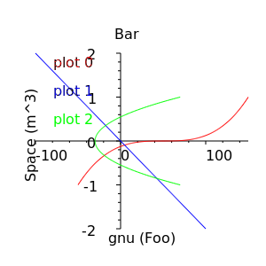
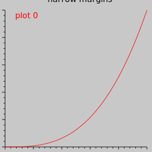
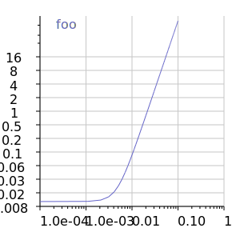
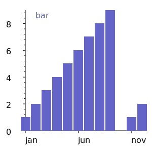
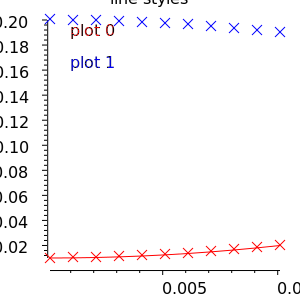
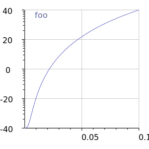

# SVGChart
A C++ Library for Making SVG Charts (fork of PPlot)

## Alpha Quality Software
This is a fork of the [PPlot](http://pplot.sourceforge.net) plotting library. All of its documentation is still relevant. The big change is compliance with modern C++ compilers and a new SVGPainter class that can output SVG files. This project is at an alpha state of completion.

## Compiler Support
This project has been tested with:

- Apple LLVM version 10.0.1 (clang-1001.0.46.4) Target: x86_64-apple-darwin18.6.0
- gcc (Raspbian 8.3.0-6+rpi1) 8.3.0
- Microsoft (R) C/C++ Optimizing Compiler Version 19.20.27508.1 for x86

## Including in Your Own Software
The easiest thing to do at this stage is just to include the four source files (`PPlot.cpp`, `PPlot.h`, `SVGPainter.cpp`, and `SVGPainter.h`) in your project.

## Examples
Examples are in the `Examples` directory. For now, there is just one example of plotting average temperatures using a line chart. You can check out the code for a sense of how to use SVGChart.

## Test Program
SVGChart comes with a test program that will output eight test SVG charts, and one painting test SVG. Just run `make` (or `nmake` on Windows) and then `./test` (or `test` on Windows) to run them.

## License
MIT License. The original two source files included here from PPlot were released under a very permissive license, which is left in the original source files and now appears in the LICENSE file. Other parts of PPlot, which are not included in this fork, were released under more restrictive licenses.
